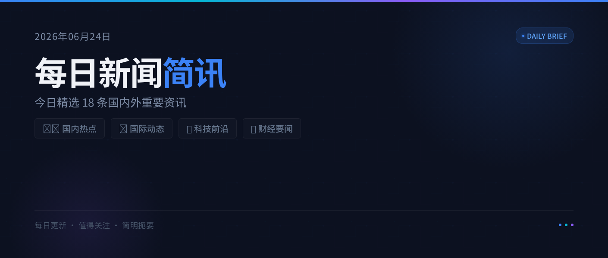

# 2026年06月14日 每日新闻简讯

> 📅 2026年06月14日 星期日 | 共18条精选新闻

---

## 🌍 国际要闻

**1. 特朗普：伊朗和平协议即将签署 霍尔木兹海峡将重新开放**

特朗普表示美伊和平协议即将签署，霍尔木兹海峡将重新开放。巴基斯坦总理称美伊有望在24小时内签署和平协议。伊朗外交部则表示签署备忘录时间不是星期天。

**2. 马斯克晋升全球首位万亿富豪**

特斯拉和SpaceX CEO马斯克身价突破万亿美元大关，成为全球首位万亿富豪。此举引发民主党人对税制不公的强烈批评。

**3. 欧洲央行宣布重启加息**

欧洲央行宣布重启加息，成为主要经济体中率先采取行动应对通胀压力的央行，打响主要经济体加息第一枪。

**4. 美国政府封杀Anthropic最新AI模型**

美国政府封杀Anthropic最新AI模型，同时多个州检察长联手对OpenAI展开调查，AI监管力度持续加强。

**5. 乌克兰将提高军饷 招募更多外国战斗人员**

乌克兰宣布将提高军人薪资，并加大招募外国战斗人员的力度，以应对持续的冲突局势。

---

## 🇨🇳 国内热点

**6. 携程因数据和个人信息出境问题被罚1000万元**

上海网信办认定上海携程商务有限公司未落实数据出境安全评估等要求，依法予以罚款1000万元人民币。

**7. 长鑫科技获批上市 成A股今年最大IPO**

中国证监会正式批复长鑫科技上市申请，该公司将成为A股市场今年最大规模的IPO，标志着国产存储芯片领域的重要进展。

**8. 考编第一却被别人递补？官方介入调查**

一名考生笔试成绩第一却在录用环节被他人递补，事件引发社会广泛关注，目前官方已介入调查。

**9. 中央气象台继续发布暴雨黄色预警**

中央气象台6月14日06时继续发布暴雨黄色预警，多地需防范强降雨及其引发的地质灾害和城市内涝。

---

## 💻 科技前沿

**10. SpaceX拟募资750亿美元**

SpaceX计划新一轮募资750亿美元。其业务呈现"一极盈利、两极亏损"格局，星链为主要盈利来源，"木头姐"已买入逾4亿美元SpaceX股票。

**11. 大疆起诉影石剽窃技术与设计**

大疆正式起诉影石创新"全盘照搬地剽窃技术与设计"，影石随后提起反诉，双方知识产权纠纷持续升级。

**12. 科大讯飞发布星火多模态大模型X2-VL**

科大讯飞正式发布星火多模态大模型X2-VL版本，在视觉语言理解能力方面实现进一步提升。

**13. 首尔禁止中小学生戴AI眼镜参加期末考试**

韩国首尔教育部门出台新规，禁止中小学生在期末考试期间佩戴AI眼镜，以防范利用AI设备进行作弊。

**14. 百度无人驾驶出租车获批在瑞士运营**

百度Apollo无人驾驶出租车获得瑞士东部地区运营许可，标志着中国自动驾驶技术出海取得新突破。

---

## 💰 财经动态

**15. 金价跌破"9字头" 菜百金条柜台爆满**

国际金价跌破"9字头"关口，引发市民抢购热潮，北京菜百金条柜台人头攒动。

**16. A股投资者突破2.5亿**

最新数据显示，A股市场投资者数量已突破2.5亿大关，散户参与度持续攀升。

**17. 吉利李书福：集中资源做强上市公司**

吉利控股董事长李书福表示将关停部分业务单元，集中资源聚焦港上市平台，做强吉利汽车上市公司。

---

## ⚽ 体育快讯

**18. 世界杯激战正酣 多场焦点赛事引全球关注**

2026美加墨世界杯激战正酣，巴西vs摩洛哥、卡塔尔绝平瑞士等多场焦点赛事引发全球球迷关注。C罗率队抵达美国开启世界杯征程，国内2万余人雨中观看"家门口的世界杯"。

---

*以上新闻综合自百度热搜、联合早报、36氪、新浪财经等媒体*

---

👆 长按识别二维码关注我们，每日为您精选国内外重要新闻

💬 觉得有用？点个「在看」分享给朋友吧！
