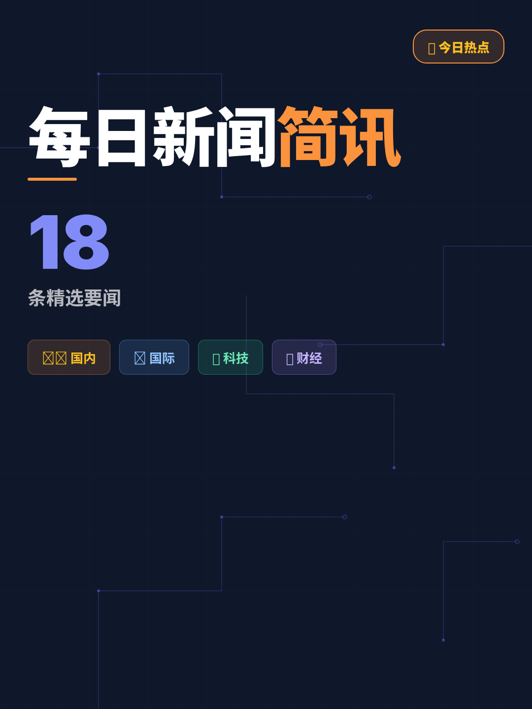

# 📰 2026年06月14日 新闻简讯

## 🌍 国际要闻

1️⃣ **特朗普：伊朗和平协议即将签署**
霍尔木兹海峡将重新开放，巴基斯坦总理称美伊有望24小时内签署协议

2️⃣ **马斯克晋升全球首位万亿富豪**
特斯拉和SpaceX CEO身价突破万亿美元，民主党人抨击税制不公

3️⃣ **欧洲央行宣布重启加息**
打响主要经济体第一枪，率先采取行动应对通胀压力

4️⃣ **美国政府封杀Anthropic最新AI模型**
同时多个州检察长联手对OpenAI展开调查

5️⃣ **乌克兰将提高军饷**
加大招募外国战斗人员力度，应对持续冲突

## 🇨🇳 国内热点

6️⃣ **携程因数据出境问题被罚1000万元**
上海网信办认定其未落实数据出境安全评估要求

7️⃣ **长鑫科技获批上市**
将成为A股今年最大IPO，证监会已正式批复

8️⃣ **考编第一却被别人递补？官方介入**
考生笔试第一却在录用环节被他人递补，引发社会关注

9️⃣ **中央气象台继续发布暴雨黄色预警**
多地需防范强降雨及其引发的次生灾害

## 💻 科技前沿

🔟 **SpaceX拟募资750亿美元**
业务呈"一极盈利、两极亏损"格局，星链为主要盈利来源

1️⃣1️⃣ **大疆起诉影石剽窃技术与设计**
指控影石"全盘照搬"，影石随后提起反诉

1️⃣2️⃣ **科大讯飞发布星火多模态大模型X2-VL**
进一步提升视觉语言理解能力

1️⃣3️⃣ **首尔禁止中小学生戴AI眼镜考试**
防止利用AI设备进行作弊

1️⃣4️⃣ **百度无人驾驶出租车获批在瑞士运营**
中国自动驾驶技术出海取得新突破

## 💰 财经动态

1️⃣5️⃣ **金价跌破"9字头"**
菜百金条柜台爆满，引发抢购热潮

1️⃣6️⃣ **A股投资者突破2.5亿**
散户参与度持续攀升

1️⃣7️⃣ **吉利李书福：集中资源做强上市公司**
将关停部分业务单元，聚焦港上市平台

## ⚽ 体育快讯

1️⃣8️⃣ **世界杯激战正酣**
巴西vs摩洛哥、卡塔尔绝平瑞士等多场焦点赛事引全球关注，C罗率队抵达美国

---
📅 每日更新 | 关注我获取最新新闻资讯

#新闻简讯 #每日新闻 #国内外新闻 #热点资讯 #新闻早知道 #2026新闻 #今日热点
